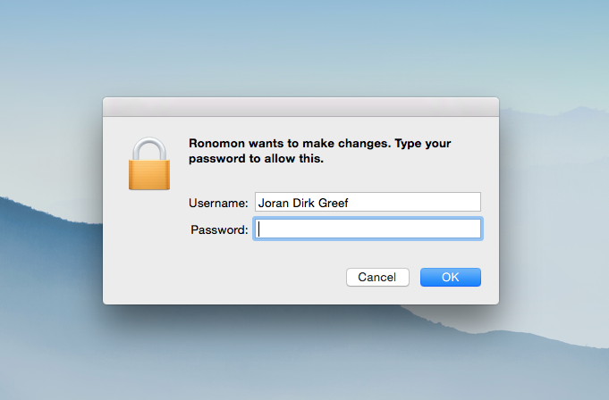

# sudo-prompt

Run a command using sudo, prompting the user with an OS dialog if necessary. Useful for background applications or native Electron apps that need sudo.



Currently supports native OS dialog prompt on Mac OS X (patches welcome for Linux) and uses process.title as the name of the app requesting permission.

sudo-prompt has no external dependencies and does not require any native bindings.

## Installation
```
npm install sudo-prompt
```

## Usage
Note: Your command should not start with the "sudo" prefix.
```
// To run a command using sudo-prompt:
var sudo = require('sudo-prompt');
sudo.exec('echo hello', function(error) {});

// To update the sudo timestamp for the current user:
// This will extend any existing sudo session for a few more minutes.
// It will prompt to create a new session if there is no existing sudo session.
sudo.touch(function(error) {});

// To use something other than process.title as the app name:
// Must be alphanumeric (may contain spaces).
sudo.setName('Your app name')
```

## Behavior
sudo-prompt should behave just like the `sudo` command in the shell. If your command does not work with the `sudo` command in the shell (perhaps because it uses `>` redirection to a restricted file), then it will not work with sudo-prompt. However, it is still possible to use sudo-prompt to get a privileged shell, [see this issue for more information](https://github.com/jorangreef/sudo-prompt/issues/1).

## Concurrency
You can call `sudo.exec` and `sudo.touch` concurrently, and sudo-prompt will batch up permission requests into a single password prompt.
